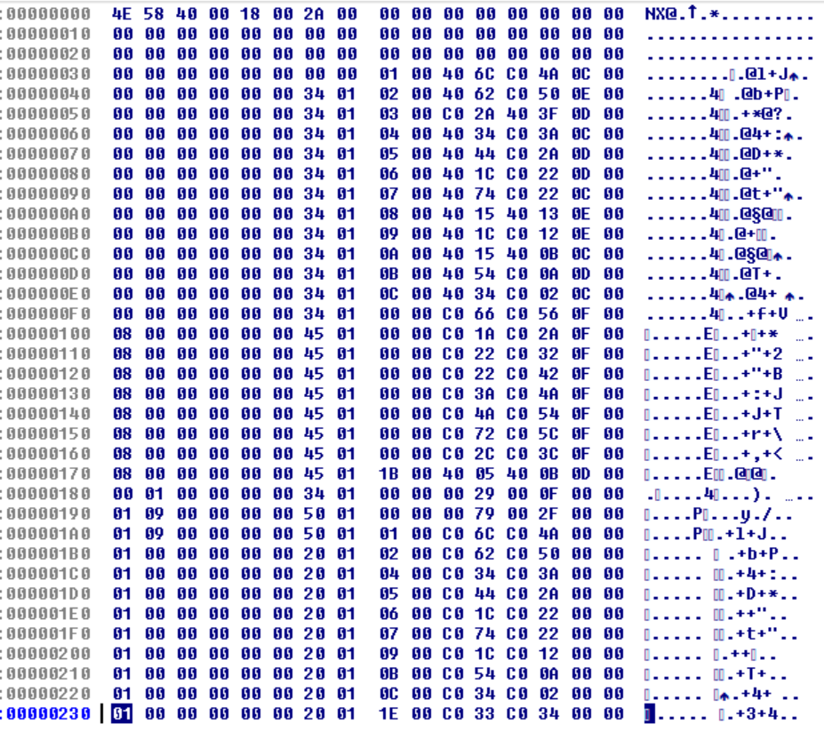

# Hacking-F117A - Part 2

We ended Part 1 with a fully functional set of secret airstrip missions for Libya and the Persian Gulf, but the North Cape was not quite working. This time around I will investigate mission generation in F-19 for comparison, and as we shall see, there are a lot of similarities to F-117A. Oh, I will also fix a 34 year old bug in both games - sort of.


### Not so different as we were led to believe, so much the better

Following the same methodology as last time, we use Cheat Engine to find the following hex values for the secret airstrips:
```
  Libya		19 and 1A
  Persian Gulf	19 and 1A
  North Cape	1E and 1F
```
This is almost identical to F-117A, except for the Persian Gulf values.

The mission numbers seem unchanged, but their descriptions are worded a little differently - so the first 4 missions now look like this:
```
  mission 0 - landing - friendly agents have captured equipment
  mission 1 - landing - guerilla freedom fighters require stinger missiles
  mission 2 - supply drop - covert agents lost their arms and equipment
  mission 3 - supply drop - guerilla group needs more weapons and explosives
```
Using debug.com, and our previous experience as a guide, it was pretty easy to find the addresses for the mission parameters:
```
  ds:B936 Primary Mission Type
  ds:B938 Primary Mission Target
  ds:B93A Takeoff Target
  ds:B93C Primary Mission Code
  ds:B93E Primary Mission Number

  ds:B948 Secondary Mission Type
  ds:B94A Secondary Mission Target
  ds:B94C Landing Target
  ds:B94E Secondary Mission Code
  ds:B950 Secondary Mission Number
```
Notice the memory layout for the mission parameters is identical to F-117A.

Using IDA I found the following code at cs:7CB1, which is very similar to that of F-117A:

  

The lookup table is still 12 bytes wide, indexed by the mission number [bp-2A]. The table starts at address 4B02h, and the first word contains the mission type, which is stored in B936. Meanwhile, the mission number itself is stored in B93E, and the mission code is stored in B93C. By inspecting the lookup table, we find that the mission code is still 2F for landing missions, and 3A for supply drops. So the complete mission parameters list in the Persian Gulf is very similar to F-117A:
```
  ds:B936 04, 19, any, 2F, 00
  ds:B936 04, 1A, any, 2F, 00
  ds:B936 04, 19, any, 2F, 01
  ds:B936 04, 1A, any, 2F, 01
  ds:B936 03, 19, any, 3A, 02
  ds:B936 03, 1A, any, 3A, 02
  ds:B936 03, 19, any, 3A, 03
  ds:B936 03, 1A, any, 3A, 03
```
Using our past experience with F-117A, I settled on address cs:7EAF to put a breakpoint, where we can edit the mission parameters at runtime. After resuming execution, we get a valid secret airstrip mission - no surprises here. And just like in F-117A, this works for Libya and the Persian Gulf, but not for the North Cape. Here are some screenshots comparing F-19 and F-117A:

  

  

  

  

  

  

  

  

  

  

  

  

So far, our debugging techniques are the same for both games, and the results show that the underlying mission structure is unchanged. My instincts told me that everything I had done so far was valid, and that the only reason we were unable to get credit for successfully completing the secret airstrip mission in the North Cape was due to a missing property in the airstrip objects themselves. In other words, the problem was in the game data, not the game code.


### Fixing the bug

Going back to F-117A, and assuming the North Cape data was bad, let's substitute data that is known to be good - for example, the Persian Gulf. By inspecting the game files, I guessed that we can ignore the 3D and sprite files, leaving the only choice possible: nc.wld. I then copied pg.wld on top of nc.wld, ran the game, and loaded the North Cape. I hit the breakpoint at cs:487D (from Part 1 of this article), and made the following mission parameter edit [4, 18, 18, 2f, 0]. Notice I used the hex values for the Persian Gulf airstrip rather than the North Cape, then resumed execution and got the following result:

  

Hmm, the airstrip appears to be in the middle of the water off the coast of Norway, and the map sector WX67 is incorrect. However, if this was the Persian Gulf map, the location of the airstrip at JZ67 would be right about there in the upper left corner. If we accept the mission, we end up sitting in the middle of the water, but we are able to complete the primary objective anyway (note I had No Crashes enabled).

  

What this tells me is that as long as we have good data, the secret airstrip mission can be completed in the North Cape. So now we have to find and modify the airstrip data in the North Cape. Let's have a look at pg.wld and nc.wld, to see what patterns emerge:

  

  

Upon casual inspection, the data appears to be in 16 byte rows, possibly indexed by target number. Recall that the hex values for the secret airstrips in the Persian Gulf are 18 and 19, whereas in the North Cape they are 1E and 1F. In pg.wld, the sequential lines 190 and 1A0 appear to be different from the surrounding lines, while in nc.wld, the lines 1F0 and 200 appear different. Could it be as easy as copying a few bytes from one file to the other? Yes! It turns out that changing the 08 to 09 at offset 1F1 and 201 in nc.wld is all we need to do - a 2 byte fix! A quick inspection of the Libya lb.wld file confirms the value should be 09.


### Conclusion

With our patch in place (for both games), we can now get credit for landing on the secret airstrips in the North Cape.

  

  

Although I fixed the bug in the North Cape data, in truth it may be a masked bug because I don't recall ever being offered a secret airstrip mission for the North Cape in the first place.
