# Hacking-F117A - Part 3

[New! Part 4 - Fixing F-19 as well](./Part4.md)

We ended Part 2 with the ability to manually insert a set of secret airstrip mission parameters via a debugger, and this allowed us to play and complete the mission objectives in all 3 theaters where the secret airstrip was documented. However, we were not able to figure out why the missions were not being offered in the first place - until now. We will finally address this problem once and for all.


### A flash of inspiration

This project hasn't seen love for over a year, until I recently came across [neuviemeporte's journal](https://neuviemeporte.github.io/category/f15-se2.html) 2 months ago. Based on neuviemeporte's description of the monster routine for generating missions in F-15 Strike Eagle II, I had no doubt that we were looking at essentially the same piece of code present in F-19 and F-117A. After reading that someone is actively working on one of Microprose's games, I was inspired to get back into this project. Also, ever since Parts 1 and 2 were first written 2 years ago, I've now switched from using debug.com to using the DOSBox debugger (highly recommended), and I've added Ghidra to my toolbox. Ghidra's decompiler window is invaluable for seeing how the code is organized at a higher level than simply looking at the disassembly. I felt ready to tackle the challenge.


### Our first stop, pg.wld

Let's start by taking a deeper look at the world data of the only confirmed theater to offer a secret airstrip mission: the Persian Gulf. Recall the beginning of pg.wld looks like this:

  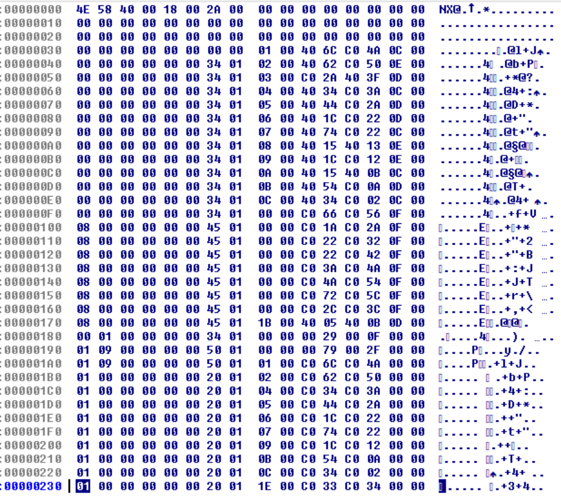

How do we make sense of this data? My first thought was to track down where this file was being read from, and then see how the data is used. After browsing around, I managed to find the code where this file is loaded. Conveniently enough, the file is sequentially read multiple times within a single routine at 54BB - here's the decompiled output.

  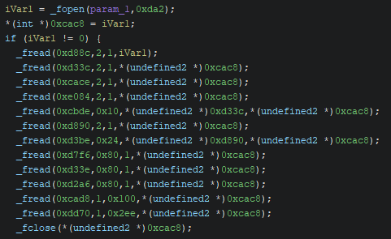

It appears F-117A was written using Microsoft C 6.0, and the documentation from 1990 gives the function prototype as fread( void *buffer, size_t size, size_t count, FILE *stream ). We can see the file is read from 4 times in a row, reading a single 2-byte value each time. This is followed by reading d33c chunks of 0x10 bytes each, and so on until closing the file. I made a table for easy reference, so I didn't have to recalculate the file offsets every time I wanted to look at the raw data file.
```
  address                 file offset   value/size   purpose          
  ---                     ---           ---          ---              
  fread(d88c, 2, 1)       0             584e                          
  fread(d33c, 2, 1)       2             40           wld_max_targets  
  fread(cace, 2, 1)       4             18                            
  fread(e084, 2, 1)       6             2a           wld_reg_targets  
  fread(cbde, 10, d33c)   8             400 bytes    wld_target_data  
  fread(d890, 2, 1)       408           c                             
  fread(d3be, 24, d890)   40a           1b0 bytes                     
  fread(d7f6, 80, 1)      5ba           80 bytes                      
  fread(d33e, 80, 1)      63a           80 bytes                      
  fread(d2a6, 80, 1)      6ba           80 bytes     wld_obj_table    
  fread(cad8, 1, 100)     73a           100 bytes                     
  fread(dd70, 1, 2ee)     83a           2ee bytes    names            
```
This means at runtime, CBDE points to 10 x 40 = 400 bytes of data, which corresponds to file offset 8. Likewise, D2A6 points to 80 bytes corresponding to the data found at file offset 6BA. Of course, the file offsets are different for each theater (and we will address them later) but for now, this mapping will do. I've given names to some of the pointers in the last column under purpose, based on my best guess.


### Next up, revisiting function 4239

Understanding function 4239 through the decompiler is so much easier than my previous attempts in Parts 1 and 2. Now we can easily see the code structure and flow control. In fact, since the routine is so large and convoluted, I'll condense it down (a lot) to the following bare bones summary:
```
  do {
                    /* 4256
                       Step 1. Initialize target list */
    if (0x32 < local_4) {
      for (local_46 = 0; local_46 < 0x80; local_46 = local_46 + 1) {
      }
      do {
      } while (*(char *)((char)world_object_not15 + 0xd2a6) == '\x15');
    }


                    /* Step 2. Pick primary target */
    do {
      if ((*(byte *)((int)*(undefined4 *)0xcaca + 0x3c) & 1) == 0) {
        do {
        } while ((*(uint *)(local_40[3] * 0x10 + 0xcbe6) & 0xd01) != 1);
        *(int *)0xe060 = local_40[3];
      }
      else {
        do {
          iVar7 = FUN_1000_51e8(1,(int)(char)world_object_not15);
          *(int *)0xe060 = iVar7;
          if (iVar7 == -1) goto LAB_1000_4256;
          if (((*(uint *)(iVar7 * 0x10 + 0xcbe6) & 0x801) == 1) ||
             ((*(byte *)(*(int *)0xe060 * 0x10 + 0xcbec) & 0x7f) != world_object_not15)) {
            local_2c = '\0';
          }
          else {
            local_2c = '\x01';
          }
        } while (local_2c == '\0');
      }


                    /* 4331
                       Step 3. Pick secondary target */
      do {
        do {
        } while ((*(byte *)(((int)local_40[3] >> 0xb) + (local_44 >> 0xb) * 0x10 + 0xcad8) & 3) != 0);
        iVar7 = FUN_1000_512e(local_40[3],local_44,2);
        *(int *)0xe072 = iVar7;
        if (100 < local_46) goto LAB_1000_4256;
      } while (local_2c == '\0');
    } while (local_30 == '\0');


                    /* 4455
                       Step 4. Pick takeoff/landing targets */
    for (current_mission = 0; current_mission < 2; current_mission = current_mission + 1) {
      for (local_46 = *(int *)0xe084; local_46 < *(int *)0xd33c; local_46 = local_46 + 1) {
        if (local_4a != '\0') {
          if ((int)local_40[2] < 0x7fff) {
            if ((int)(iVar7 + local_40[2]) <
                (int)((-(uint)((*(byte *)((int)local_2e + 9) & 2) != 0) & 0xc80) +
                     local_40[current_mission])) {
              *(int *)(current_mission * 0x12 + 0xe062) = local_46;
            }
          }
        }
      }
    }


                    /* 465c
                       Step 5. Get compatible mission */
    for (local_46 = 0; uVar8 = local_40[0], local_46 < 2; local_46 = local_46 + 1) {
      for (local_d0 = 0; local_d0 < 2; local_d0 = local_d0 + 1) {
        for (current_mission = 0; current_mission < 0x52; current_mission = current_mission + 1) {
          iVar7 = current_mission * 0xc;
          iVar9 = (int)*(undefined4 *)0xcaca;
                    /* 5a: if (mis_table_11da[current_mission].glob_settings.theater).bitmask and */
                    /* 5b: (mis_table_11dc[current_mission].glob_settings.tension).bitmask and */
                    /* 5c: wld_obj_table_6ba[wld_target_data_008[e060/e072].object_016] == mis_table_11e0[] */
                    /* 5d: and (first loop || primary mission != current mission) */
          if (((((*(uint *)(iVar7 + 0x11da) & 1 << (*(byte *)(iVar9 + 0x38) & 0x1f)) != 0) &&
               ((*(uint *)(iVar7 + 0x11dc) & 1 << (*(byte *)(iVar9 + 0x3a) & 0x1f)) != 0)) &&
              ((int)*(char *)((*(byte *)(*(int *)(local_46 * 0x12 + 0xe060) * 0x10 + 0xcbec) &
                              0x7f) + 0xd2a6) == *(int *)(iVar7 + 0x11e0))) &&
             ((local_46 == 0 || (*(int *)0xe066 != current_mission)))) {
            if ((local_d0 != 0) && (local_24 == mission_count)) {
              iVar10 = current_mission * 0xc;
              iVar9 = local_46 * 0x12;
                    /* e05e_mission_type = mis_table_11de[current_mission].mission_type */
              *(undefined2 *)(iVar9 + 0xe05e) = *(undefined2 *)(iVar10 + 0x11de);
                    /* e066_mission_number = current_mission */
              *(int *)(iVar9 + 0xe066) = current_mission;
              iVar7 = *(int *)(iVar10 + 0x11e2);
                    /* e064_mission_code = mis_table_11e2[current_mission].mission_code */
              *(int *)(iVar9 + 0xe064) = iVar7;
            }
          }
        }
      }
    }


                    /* 47bf
                       Step 6. Final check for mission compatibility */
                    /* 6a: if glob_settings.mission == air or
                       0 < mission_type < 5 */
    if (((((*(byte *)(*(int *)0xcaca + 0x3c) & 1) == 0) ||
         ((*(int *)0xe05e < 5 && (*(int *)0xe070 < 5)))) && (*(int *)0xe05e != 0)) &&
       (*(int *)0xe070 != 0)) {
                    /* 6b: if mission_numbers are not the same */
      if (*(int *)0xe066 != *(int *)0xe078) {
                    /* 6c: if secondary.mission_code == 0 */
        if (((*(byte *)0xe076 & 2) == 0) || ((*(byte *)0xe076 & 2) == 0)) {
                    /* 6d: if secondary_mission_type < 5 or > 8 and */
                    /* 6e: primary_mission_type != 4 or global_settings.quality != green and */
                    /* 6f: one of the mission_codes != secret airstrip */
          if (((iVar7 < 5) || (iVar7 != 8 && 2 < iVar7 + -5)) &&
             (((*(int *)0xe05e != 4 || (*(int *)0xcabe != 0)) &&
              (((*(byte *)0xe064 & 8) == 0 || ((*(byte *)0xe076 & 8) == 0)))))) {
                    /* 487d
                       Goal reached, no further mission changes, as per Part 1 */
            return;
          }
        }
      }
    }
  } while( true );
```
In step 1, we construct a dynamic array of targets from the wld_obj_table. Recall from our file offsets table above that this section is 80 bytes long, which exactly matches the for loop here. We basically loop through all 80 bytes, looking for non-zero entries, and if found, add that index to the target array. In the while loop, we randomly pick one of these entries. So from step 1 we already have an important clue as to how a target is included for random selection - it must have a non-zero value in the wld_obj_table. This will become important later as we solve the riddle of secret airstrip missions in the North Cape (and Libya).

In step 2, the goal is to pick a target and save it to (our friend from Part 1) E060 - the primary target. Depending on the value of *(*CACA + 3C), we take 1 of 2 branches. However, both branches end with assigning a target to E060. Notice the else branch contains a call to function 51E8 before assignment: this was covered in Part 1. What is CACA all about? It turns out, by randomly inserting values here via the debugger, and observing what happens in-game, I found out this is the global settings area.
```
  offset   setting   zero-based enumeration
  ---      ---       ---
  38       theater   libya, persian gulf, north cape, central europe, vietnam, middle east, desert storm, cuba, korea
  3a       tension   cold, limited, conventional
  3c       mission   air, strike, air training, strike training
  3e       quality   green, regular, veteran, elite
  40       landing   no crashes, easy landings, realistic landings
  42       realism   microprose, lockheed
```
So for example, if you've chosen the Persian Gulf, *(*CACA + 38) would be 1, or if you've chosen elite opponents, *(*CACA + 3E) would be 3. For the record, my own settings for the bulk of the research here is the following: persian gulf, cold war, strike mission, green opponents, no crashes, and microprose realism. So back in the code, *(*CACA + 3C) is checking what type of mission has been selected. If it's an air-to-air mission, take the first branch, otherwise take the else branch. If a target couldn't be found (iVar7 == -1), goto the top of the loop. Let's examine the expression ((*(iVar7 * 0x10 + 0xcbe6) & 0x801) == 1). Address CBE6 is only 8 bytes away from CBDE (wld_target_data), which we know is 40 lines of 10 bytes each. This means CBDE is the base pointer to an array of (40) structures (each of size 10), and CBE6 points to one of the members of the struct at offset 8, which I named target_flags.
```
  offset   address   purpose
  ---      ---       ---
  0        cbde
  2        cbe0      wld_x_coord
  4        cbe2      wld_y_coord
  8        cbe6      target_flags
  e        cbec      object
```
This means the C equivalent to the expression above is something like wld_target_data[iVar7].target_flags & 801 == 1. Its purpose is to filter out targets that are air-to-air specific (because this is a strike mission remember?). The expression ((*(*0xe060 * 0x10 + 0xcbec) & 0x7f) != world_object_not15) similarly checks one of the members of the struct at offset 0xe, to make sure the object there equals the randomly picked one in step 1. Essentially, each target in the wld_target_data area only works with a specific object in the wld_obj_table area, so if your randomly picked target doesn't match what the mission supports, then you must choose again. That means the secret airstrips in the Persian Gulf, whose target values are 18 and 19, only work with the object at index 50 as shown here. Again, this will be important later to solve the riddle in the North Cape.

  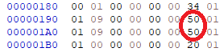

In step 3, there's nothing important here that I want to comment on. Let's just say that a random target is selected at function 512E and saved to E072, the secondary target. If we've exhausted all options, goto the top of the loop and start over, otherwise keep looking for a candidate target.

In step 4, the goal is to save the takeoff and landing targets to E062 and E074 respectively. Again, there's nothing special here that I want to comment on.

In step 5, we have a triple for loop and a pair of if statements, with lots of interesting things going on. This section deals with picking the mission type, number, and code. We touched on this section in Part 1, but at the time, we only focused on how the values were pulled from a table. This time, we will examine the surrounding if statement to understand what's really going on. I've already included some comments to make it easier to follow. The inner for loop goes through each mission (up to 0x52 of them so my estimate of 40-50 missions from Part 1 seems a bit low), and checks it against a table via this expression ((*(iVar7 + 0x11da) & 1 << (*(iVar9 + 0x38) & 0x1f)) != 0). What's this table at 11DA all about? This is the mission table which specifies which missions are valid for which theater, among other things. A snippet of the table (which is 0xc bytes wide) is shown here, followed by my interpretation of the offsets.

  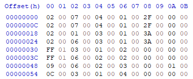

```
  offset   address   purpose
  ---      ---       ---
  0        11da      theater bitmask
  2        11dc      tension bitmask
  4        11de      mission_type
  6        11e0      object_flag
  8        11e2      mission_code
```
So basically the expression is checking the table whether the current mission supports the chosen theater via bitmask, as indicated by my clumsy comment "5a if (mis_table_11da[current_mission].glob_settings.theater).bitmask". Since we are currently in the Persian Gulf, that means the theater value is 1, and 1 left shifted by 1 equals 2. This bit position is consistent with the value 2 in the mission table at offset 0, therefore mission 0 (the secret airstrip mission) is valid for the Persian Gulf. Likewise, the table values at offsets 0xc, 0x18, and 0x24 are all 2, indicating that missions 1, 2, and 3 are also valid for the Persian Gulf. This is evidence that the secret airstrip missions are offered only in the Persian Gulf and nowhere else. The next line at 5b is similar - the bit position of the current tension (cold, limited, conventional war) needs to be consistent with the value at offset 2, which happens to be 7. This means that the secret airstrip mission is supported in all 3 tension types (because 1 left shifted by 0, 1, or 2 are all consistent with the value 7).

The next line 5c is a little convoluted, but it goes something like this: lookup the primary or secondary mission in wld_target_data, and find the object there at offset 0xe (wld_target_data[e060/e072].object). Using this object value, lookup wld_obj_table and make sure this is equal to the object_flag at address 11E0 in the mission table. For example, suppose the target is 18. Lookup wld_target_data[18] offset by 0xe, which happens to be at file offset 196. This would be the circled 50 from a couple of screenshots above. Now lookup 50 in wld_obj_data, and make sure the value there equals the value of mission_table[mission 0].object_flag, which in this case has the value 1 for the first 4 missions. If they're equal, then this mission is suitable for inclusion. Lastly, the next line 5d simply makes sure that the primary mission details are filled in on the first loop, and the secondary mission details are filled in on the next loop (as long as the missions are not the same). If all the above conditions are met, we can go ahead and pull the relevant mission parameters from the table and assign them as appropriate.

In step 6, we perform the final checks on mission compatibility with 4 nested if statements. At 6a, if the mission is air-to-air, or if the mission_type is within the bounds 0 and 5, we can proceed. At 6b, as long the primary and secondary mission numbers are not the same (E066 != E078), we can proceed. At 6c, if the secondary mission_code is 0, we can proceed. This rule effectively prevents the secondary objective from being the secret airstrip, because the mission_codes for the airstrips are 2F and 3A. 6d is almost a duplicate of 6a, so let's ignore. At 6e, the primary mission_type != 4 or global_settings.quality != green. So either the mission is not a secret landing, or if it is, then your opponents better be higher than green. This explains why I was having trouble getting secret landing missions, because my normal test settings were using green opponents. Why does CABE point to opponent quality? Shouldn't we be looking at *(*CACA + 3E) instead? It turns out that CABE is a duplicate, and whatever is stored in (*CACA + 3E) is also stored at CABE during runtime. Lastly at 6f, at least one of the primary or secondary mission_codes better not be a secret airstrip mission. There seem to be a lot of checks against the secret airstrip missions, doesn't it? Anyway, after passing all these checks, we finally make it to address 487D, which as we recall from Part 1, means there are no further changes to the selected mission objectives.


### Putting it all together, and patching the files

From step 1, we know we need a non-zero value in the wld_obj_table. Which entry, and what value? From step 2, we know the object associated with the secret airstrips is at index 50.

  

That means wld_obj_table[50] needs a certain value. From step 5c, we know the value must equal 1, as indicated by mission_table[0].object_flag. For the Persian Gulf, wld_obj_table[50] is at file offset 6BA + 50 = 70A. Inspecting pg.wld at file offset 70A, we see there is indeed a 1 here (no surprise).

  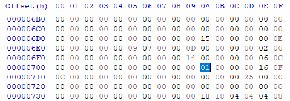

Let's expand the table of file offsets to include Libya (lb.wld) and the North Cape (nc.wld).
```
  address                 file offset   value/size   purpose           lb off   lb v/s   nc off   nc v/s
  ---                     ---           ---          ---               ---      ---      ---      ---
  fread(d88c, 2, 1)       0             584e                           0        584a     0        4e42
  fread(d33c, 2, 1)       2             40           wld_max_targets   2        25       2        2e
  fread(cace, 2, 1)       4             18                             4        14       4        13
  fread(e084, 2, 1)       6             2a           wld_reg_targets   6        21       6        24
  fread(cbde, 10, d33c)   8             400 bytes    wld_target_data   8        250 b    8        2e0 b
  fread(d890, 2, 1)       408           c                              258      b        2e8      d
  fread(d3be, 24, d890)   40a           1b0 bytes                      25a      18c b    2ea      1d4 b
  fread(d7f6, 80, 1)      5ba           80 bytes                       3e6      80 b     4be      80 b
  fread(d33e, 80, 1)      63a           80 bytes                       466      80 b     53e      80 b
  fread(d2a6, 80, 1)      6ba           80 bytes     wld_obj_table     4e6      80 b     5be      80 b
  fread(cad8, 1, 100)     73a           100 bytes                      566      100 b    63e      100 b
  fread(dd70, 1, 2ee)     83a           2ee bytes    names             666      2ee b    73e      2ee b
```
The secret airstrips in Libya reference object 54

  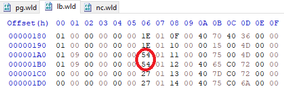

so lb.wld at file offset 4E6 + 54 = 53A looks like this, after changing the 0 to a 1 (highlighted in red).

  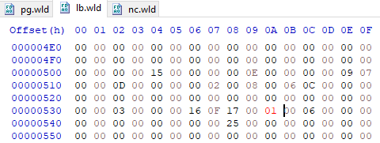

Similarly for the North Cape, the secret airstrips reference object 49. Note that I've also changed the 8s to 9s (highlighted in red) for the reasons explained in Part 2.

  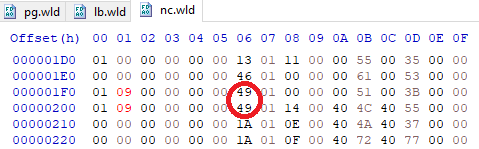

So nc.wld at file offset 5BE + 49 = 607 looks like this (after changing the 0 to a 1).

  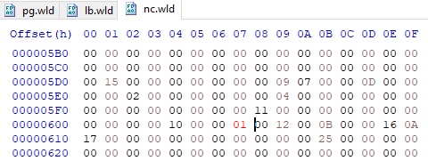

We still have the issue of the mission table to deal with, because the theater bitmask only includes the Persian Gulf. In order to allow all 3 theaters to work, we need to change the bitmask from 2 to 7. Where is this mission table? It's actually hardcoded in the executable itself. However, since the executable is packed (with lzexe I believe) you need to find an unpacker. I did so a long time ago, but now I've lost my notes on what I used, so all I can tell you is that the packed size of start.exe is 47100 bytes, and the unpacked size is 90047 bytes. Searching through the unpacked start.exe for 2 0 7 0 4 yields a hit at BF2A, and here's what it looks like after changing the 2s to 7s for the first 4 table entries.

  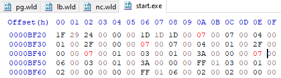


### Conclusion

Now we are ready - let's load up our patched game and see what happens. Don't forget to set opponent quality to regular or higher. In Libya, we are offered a secret airstrip mission at ONC VC43, and in the North Cape, we are offered one at ONC XX20.

  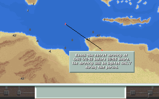

  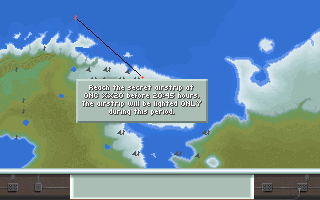

Mission accomplished! It looks like Microprose deliberately removed the secret airstrip missions from Libya and the North Cape, but by changing 8 bytes in 3 files, we can get the option again.

[New! Part 4 - Fixing F-19 as well](./Part4.md)
