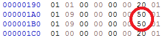
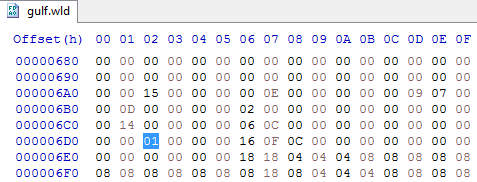
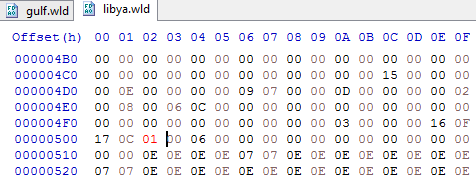
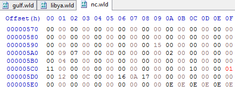
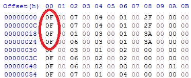
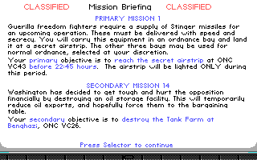
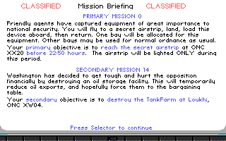

# Hacking-F117A - Part 4

We ended Part 3 with secret airstrip missions being offered and playable in Libya, the Persian Gulf, and the North Cape, after patching F-117A. This time, we will do the same for F-19. Since most of the analysis has already been done in F-117A, this article might be a bit shorter than the others, but we're including it here for completeness.


### Revisiting ~~pg.wld~~ gulf.wld

The Persian Gulf world data file is named gulf.wld in F-19, instead of pg.wld like in F-117A. When we track down how this file is being read from, we see that the file format is slightly smaller than F-117A. In particular, the 3 consecutive 80-byte reads have now been replaced by 3 consecutive 64-byte reads:
```
  address                 file offset   value/size   purpose          
  ---                     ---           ---          ---              
  fread(ca3e, 2, 1)       0             584e                          
  fread(c964, 2, 1)       2             40           wld_max_targets  
  fread(993a, 2, 1)       4             19                            
  fread(d04a, 2, 1)       6             2b                            
  fread(b37e, 10, c964)   8             400 b        wld_target_data  
  fread(ca52, 2, 1)       408           c                             
  fread(bb68, 24, ca52)   40a           1b0 b                         
  fread(c9ce, 64, 1)      5ba           64 b                          
  fread(c966, 64, 1)      61e           64 b                          
  fread(c150, 64, 1)      682           64 b         wld_obj_table    
  fread(b832, 1, 100)     6e6           100 b                         
  fread(cb24, 1, 2ee)     7e6           2ee b        names            
```


### Patching the files

Recall from Part 2 that the secret airstrips in the Persian Gulf have slightly different values in F-19, so the data file offsets will be different. However, the location is easily recognizable from the pair of 9s pattern, and values are still object 50.

  

Therefore wld_obj_table[50] is at file offset 682 + 50 = 6D2. Inspecting gulf.wld at file offset 6D2, we see there is indeed a 1 here. So far so good.

  

Let's expand the table of file offsets to include Libya (libya.wld) and the North Cape (nc.wld).
```
  address                 file offset   value/size   purpose           lb off   lb v/s   nc off   nc v/s
  ---                     ---           ---          ---               ---      ---      ---      ---
  fread(ca3e, 2, 1)       0             584e                           0        584a     0        4e42
  fread(c964, 2, 1)       2             40           wld_max_targets   2        25       2        2e
  fread(993a, 2, 1)       4             19                             4        14       4        12
  fread(d04a, 2, 1)       6             2b                             6        21       6        20
  fread(b37e, 10, c964)   8             400 b        wld_target_data   8        250 b    8        2e0 b
  fread(ca52, 2, 1)       408           c                              258      b        2e8      d
  fread(bb68, 24, ca52)   40a           1b0 b                          25a      18c b    2ea      1d4 b
  fread(c9ce, 64, 1)      5ba           64 b                           3e6      64 b     4be      64 b
  fread(c966, 64, 1)      61e           64 b                           44a      64 b     522      64 b
  fread(c150, 64, 1)      682           64 b         wld_obj_table     4ae      64 b     586      64 b
  fread(b832, 1, 100)     6e6           100 b                          512      100 b    5ea      100 b
  fread(cb24, 1, 2ee)     7e6           2ee b        names             612      2ee b    6ea      2ee b
```
The secret airstrips in Libya still reference object 54

  

so libya.wld at file offset 4AE + 54 = 502 looks like this, after changing the 0 to a 1 (highlighted in red).

  

Similarly for the North Cape, the secret airstrips still reference object 49. Note that I've also changed the 8s to 9s (highlighted in red) for the reasons explained in Part 2.

  

So nc.wld at file offset 586 + 49 = 5CF looks like this (after changing the 0 to a 1).

  

I managed to rediscover what tools I used to unpack the executables: for F-117A, I used [unlzexe](https://files.shikadi.net/keenwiki/tools/t.unlzexe_v.0.81_win_32-bit.gerstrong.2010-07-04.zip) and for F-19, I used [upackexe](https://bellard.org/lzexe/lzexe91.zip). The packed/unpacked sizes are 47100/90047 and 87599/106288 respectively. When we inspect the mission table hardcoded in the executable, we see that we don't need to patch it, because in F-19 the theater bitmask already allows all 3 theaters to work, with a value of 0xF. What this means is that the code already supported generating secret airstrip missions for Libya and the North Cape, but because the object reference was missing in each of libya.wld and nc.wld, the missions could not be picked (bug or deliberate?).

  


### Conclusion

Now we are ready - let's load up our patched game and see what happens. Don't forget to set opponent quality to regular or higher. In Libya, we are offered a secret airstrip mission at ONC VC43, and in the North Cape, we are offered one at ONC XX20.

  

  

Mission accomplished! By changing 4 bytes in 2 files, we can get the secret airstrip missions in Libya and the North Cape as it was originally documented.
