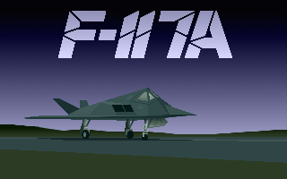
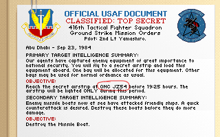
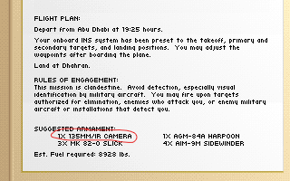
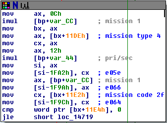
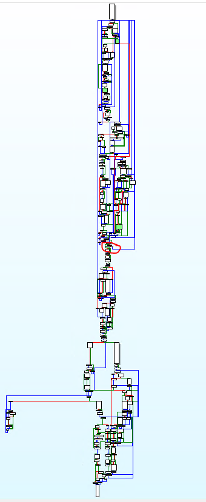
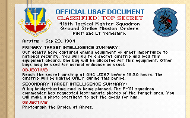
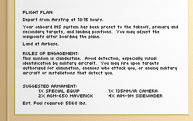
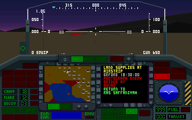
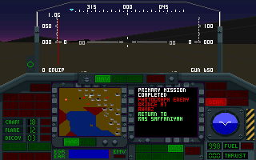

# Hacking-F117A

My investigation into mission generation in the Stealth Fighter games by Microprose.

[Part 2 - Fixing the bug (sort of)](./Part2.md) 
[Part 3 - Really fixing the bug](./Part3.md) 
[New! Part 4 - Fixing F-19 as well](./Part4.md) 

  


### Background

Two of my favorite DOS games are F-19 Stealth Fighter and its 1991 remake F-117A Nighthawk Stealth Fighter 2.0. Both games come in heavy boxes, each packed with a thick manual offering a wealth of detailed information. As a pilot, you can choose to fly air-to-air missions or strike missions, and the manual hints at a special type of strike mission - the secret airstrip. The objective is to land at a secret airstrip behind enemy lines to drop off or pickup equipment, then safely fly home. This is an excerpt from the manual, which can be found here [F-19](https://archive.org/stream/f19stealthfightermanual/F19-StealthFighter-Manual_djvu.txt) and 
here [F-117A](https://archive.org/stream/f117Astealthfightermanual/F-117AStealthFighter-Manual_djvu.txt).

> Instead, a secret airstrip challenges your flying skill. You must manage a landing without an ILS to guide you. Worse, the strip is only half the length of a normal runway. You must land gently, at low speed (under 160 kts, preferably), and touchdown near the start. Otherwise you'll roll off the other end and crash! To make matters worse, the strip's lights are only for a limited time.

The secret airstrips are documented in the F-19 manual in 3 theaters: Libya, Persian Gulf, and North Cape.

> Secret Bases: Western intelligence operatives in Libya are preparing two secret, hard-pack surfaces suitable for aircraft landings. One is at Al Mukhayli (ONC VC43), the other is on the edge of the great ergs, at Yafran (ONC TC93).

> Secret Bases: Western intelligence operatives in Iran are preparing two secret, hard-pack surfaces suitable for aircraft landings. One is in the Shalamzar valley (JZ67) in the Zagros Mountains, the other in the mountains south of Kerman, at KZ82.

> Secret Bases: Western intelligence operatives in this area have secret created two hard-frozen airstrips suitable for landings, one at XW57, the other at XX20.

However, in the F-117A manual, the locations of the secret airstrips have been omitted entirely.


### Hacking the mission

The missions are generated randomly, and if your intention is to fly the secret airstrip, you would normally have to decline the offered mission repeatedly until the right combination is presented. As I found out, it appears to be quite rare (or else I was extremely unlucky), because I was not offered this mission after declining repeatedly (upwards of 20 minutes) - long enough for me to feel bored and sleepy. What would it take to reliably generate the secret airstrip mission, so you could play it on demand?

Of the two games, I started hacking around with F-117A (v473.03), since it was the newer and prettier of the two. The first step was to hack the memory contents using Cheat Engine. With careful planning and scanning of memory addresses, declining the mission, then scanning again, I was able to identify two potential locations called the Primary Target and Secondary Target. By sequentially incrementing the byte at these two locations, and then observing the effects in-game, I was able to identify the hex values for the secret airstrips:
```
  Libya		19 and 1A
  Persian Gulf	18 and 19
  North Cape	1E and 1F
```
However, simply plugging these hex values into the Primary or Secondary Target addresses was not good enough. When you do so, you often end up seeing missions like "Photograph the Airstrip" or "Destroy the Airstrip". Clearly there are other mission parameters which control the overall mission objectives. After more scanning of changed memory values, I found additional addresses which contributed in some way to the overall mission:
```
  Primary Mission Type - values 1-4, see mission_type below
  Primary Mission Target - hex value for the primary target
  Takeoff Target - the starting point for your mission
  Primary Mission Number - description and background info for your mission

  Secondary Mission Type - values 1-4, see mission_type below
  Secondary Mission Target - hex value for the secondary target
  Landing Target - the ending point for your mission
  Secondary Mission Number - description and background info for your mission

  enum mission_type {
      photograph = 1,
      destroy = 2,
      supply_drop = 3,
      landing = 4,
  };
```
Now that the mission parameters are more fully fleshed out, we see that there are 4 mission types: you can either photograph or destroy a target. For the special case of secret airstrips, you can also fly over it to drop supplies, or for the ultimate thrill, land on it. This is represented by the C-style enum mission_type, with possible values from 1 to 4. Notice we can potentially have a landing mission for both the primary and secondary objectives. Normally the game logic would prevent this outcome by automatically selecting a different mission for the secondary objective.

Another interesting point is the takeoff and landing targets - normally you would start and end the missions on friendly airstrips. But by specifying the correct hex values for takeoff and landing, you can actually start the mission already in enemy territory! Furthermore, if you specify the secret airstrips as your takeoff and landing targets, you could potentially accomplish a primary or secondary objective without even lifting off! But we're getting a little ahead of ourselves.

Finally, there is the mission number, which is an index to a lookup table. Here you will receive your mission orders, often with background info, to set the mood. By sequentially incrementing the value here and observing the effects in-game, I estimate there to be roughly 40 or 50 different missions. However, the first 4 missions are special:
```
  mission 0 - landing - "our agents have captured enemy equipment ..."
  mission 1 - landing - "guerilla freedom fighters need stinger missiles ..."
  mission 2 - supply drop - "covert agents lost their arms and equipment ..."
  mission 3 - supply drop - "guerilla group needs weapons and explosives ..."
```
In practice, editing the mission targets with Cheat Engine after the mission has already been generated doesn't quite produce the desired results. For example, even though I specified mission type 4, mission target 18, and mission number 0 in the Persian Gulf, the mission description is not quite right.

  

Here we see the map sector for the airstrip doesn't match the published location JZ67. Also note in the next screen, the wrong weapon was auto-selected to fill the cargo bay.

  


### Under the hood

In order to fully understand what's going on, we need to load the game in a debugger. Using the old 16-bit DOS debugger debug.com, I stepped over function calls until I narrowed down the following stack trace:
```
  cs:028D call 0FA3 - enter briefing room
  cs:0FA9 call 0F4E - show flight plan
  cs:411E call 4239 - get new missions
```
Now we're getting close - when function 4239 returns, new missions will have been generated and offered. So we just need to look closer at function 4239 to see where we might override the mission parameters. After stepping through 4239, I came across the following interesting instructions:
```
  cs:42E9 call 51E8
  cs:42EE mov [E060], ax

  cs:43C2 call 512E
  cs:43C8 mov [E072], ax
```
What's happening here is that a target is generated at 51E8, returned in ax, then stored in address E060. Later, another target is generated at 512E, then stored in address E072. In fact, what we have here is the location of the Primary and Secondary Targets - hurrah! Now that we have real addresses worth mentioning, I can annotate the mission parameters from above like so:
```
  ds:E05E Primary Mission Type
  ds:E060 Primary Mission Target
  ds:E062 Takeoff Target
  ds:E064 ??
  ds:E066 Primary Mission Number

  ds:E070 Secondary Mission Type
  ds:E072 Secondary Mission Target
  ds:E074 Landing Target
  ds:E076 ??
  ds:E078 Secondary Mission Number
```
First, I tried modifying functions 51E8 and 512E to return 18 and 19 respectively, to see what would happen. The game logic would later validate these targets, and ultimately reject one of the airstrip targets by substituting a different target. In this way, you end up with only one landing mission, and the other mission was typically a photograph or destroy mission. Presumably this was done to ensure variety in the randomly generated missions. Even though my modification forced a secret airstrip as a mission target, in practice I observed that the game would almost always choose mission type 3 (supply drop) for it, rather than the desired type 4.

Also, although my modification was partially successful for Libya and the Persian Gulf, it failed miserably in the North Cape. What ended up happening in the North Cape was that function 4239 would go into an infinite loop. I think the reason might be that it was unable to find a substitute target to satisfy the mission requirements - my question was, why was the North Cape theater the only one affected? I didn't really have an answer, but we will come back to this question later.

So directly hacking functions 51E8 and 512E didn't seem like a viable approach, and I needed a better way. There is a special relationship between the mission type, mission target, and the mission number. Since missions 0-3 involve secret airstrips, that limits the allowed mission types and mission targets. For example, missions 0 and 1 are both landing missions, so the mission type must be 4. Furthermore, the mission target must be either 18 or 19 in the Persian Gulf. Since missions 2 and 3 are supply drop missions, the mission type must be 3. So the list of possible Primary mission parameters for the Persian Gulf goes something like this (ignoring any takeoff target):
```
  ds:E05E 04, 18, any, ??, 00
  ds:E05E 04, 19, any, ??, 00
  ds:E05E 04, 18, any, ??, 01
  ds:E05E 04, 19, any, ??, 01
  ds:E05E 03, 18, any, ??, 02
  ds:E05E 03, 19, any, ??, 02
  ds:E05E 03, 18, any, ??, 03
  ds:E05E 03, 19, any, ??, 03
```
To gain a better understanding of the disassembly, I used an old tool called IDA Freeware Version 5.0, which supports 16-bit DOS targets - their most recent free offerings do not support 16-bit anymore. I searched for interesting instructions that wrote to address E05E or E066, and found the following code at cs:46DB

  

Bingo! What we have here is a lookup table with rows 12 bytes wide, indexed by the mission number var_CC. The lookup table starts at address 11DEh, and the first word contains the mission type, which is eventually stored in E05E. Meanwhile, the mission number itself is stored in E066, and something I'll call a mission code is stored in E064. Finally we can talk about the mission code, denoted by double question marks ?? above. What is it? It's a number that is specific to each mission, and the value is not calculated - rather, it's fetched from a table. I believe this mission code is a set of bit flags used in the simulation portion of the game, and these flags indicate how a successful mission is determined. By inspecting the lookup table, I found that the mission code is 2F for landing missions, and 3A for supply drops. So the complete mission parameters list now looks like this:
```
  ds:E05E 04, 18, any, 2F, 00
  ds:E05E 04, 19, any, 2F, 00
  ds:E05E 04, 18, any, 2F, 01
  ds:E05E 04, 19, any, 2F, 01
  ds:E05E 03, 18, any, 3A, 02
  ds:E05E 03, 19, any, 3A, 02
  ds:E05E 03, 18, any, 3A, 03
  ds:E05E 03, 19, any, 3A, 03
```
If I modify any of the memory above to set the mission parameters that I want, or even just change the values at runtime using the debugger, the same thing happens as before: the game logic later validates the missions and eventually substitutes a different mission target - how annoying. What I need to do is modify the mission parameters AFTER all the validation and substitution has already been done. The graph view of IDA is useful to get a bird's eye view of the program flow control, so here's the graph of function 4239:

  

For reference, I've highlighted in green 3 of the interesting code blocks. Near the top of the graph, E060 is written to at address cs:42EE. A little bit lower down, E072 is written to at address cs:43C8. Almost midway down the graph, E05E, E066, and E064 are written to at address cs:46DB. You can see by all the lines leading back to the top of the function how missions are validated, and targets can be substituted.

By a little trial and error, I settled on the circled region as the earliest point at which the code doesn't jump back on itself to ruin my carefully chosen mission parameters. This region is at address cs:487D. If I simply set a breakpoint at cs:487D, then modify the contents of ds:E05E to ds:E066 at runtime with the values [04, 18, 18, 2F, 00], then resume program execution, I get the following results:

  

  

Now the location of the secret airstrip is shown as JZ67, and on the next screen, the cargo bay has been reserved for the special equipment that will be loaded aboard. If you accept the mission and enter the simulation, the primary mission in yellow does indeed call for landing supplies at the airstrip:

  

When you land on the secret airstrip, thereby completing the primary objective, it looks like this:

  


### Conclusion

Success! Repeating the experiment with all 4 secret airstrips in Libya and the Persian Gulf gives the same results - I can now choose any of these landing missions on demand.

What about the North Cape? The landing mission simply will not work, even though everything appears ok - the mission descriptions are correct, the special equipment is reserved in the cargo bay, and the mission orders in the simulation are correct. However, no matter how hard I try, I can never get credit for completing the objective. After repeated attempts, I'm starting to suspect that this is a bug in the game. My prevailing theory is that there is a missing property on the 2 secret airstrips in the North Cape, which prevent the simulation from detecting when a mission objective has been completed. Are there any Microprose alumni out there who are able to confirm?

[Part 2 - Fixing the bug (sort of)](./Part2.md) 
[Part 3 - Really fixing the bug](./Part3.md) 
[New! Part 4 - Fixing F-19 as well](./Part4.md) 
